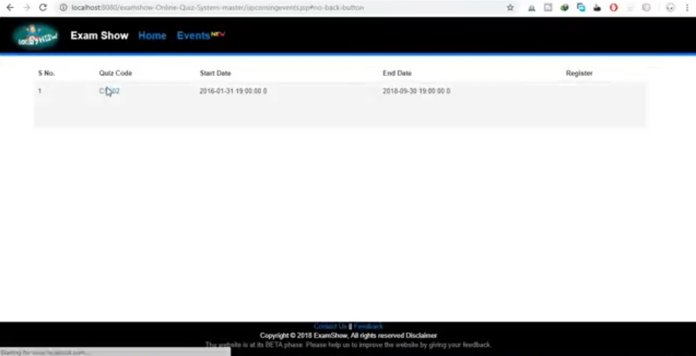
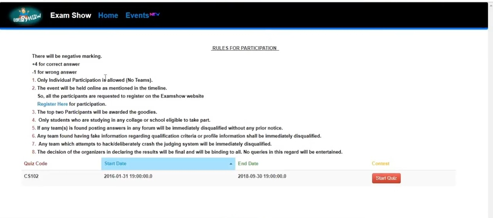
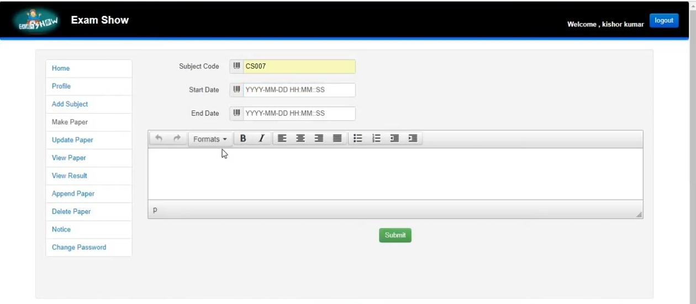
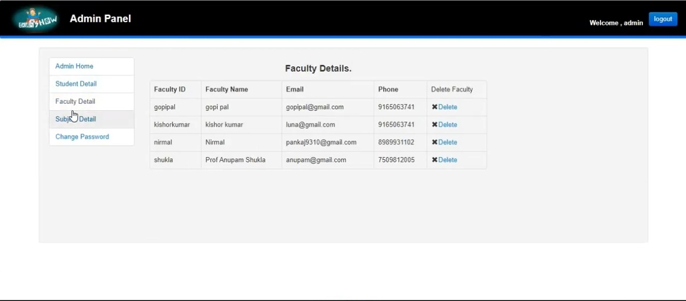
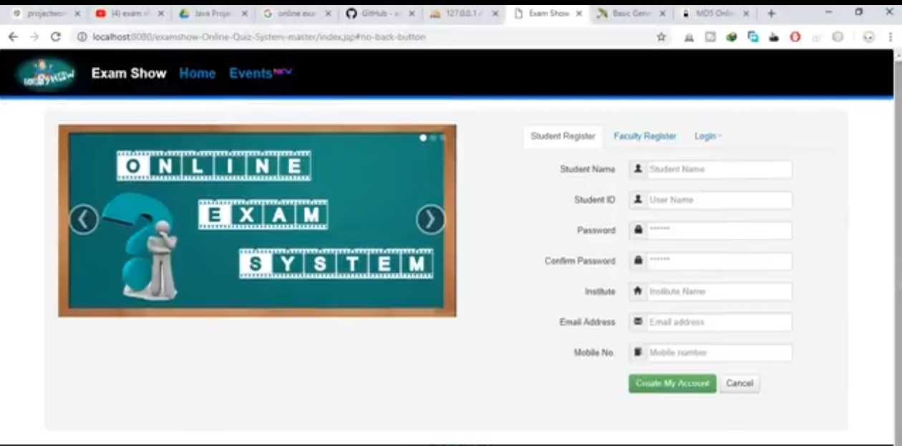

# ExamShow - Java Full Stack Online Exam System

ExamShow is a comprehensive Online Exam and Quiz System designed for Educational Institutes. It enables faculties to prepare and host online exams, quizzes, and technical events for students across various domains like Programming, Science, and Sports.

## 🚀 Core Technologies Used (Java Full Stack)

**Why Java?** Java ensures the application is robust, scalable, and platform-independent ("Write Once, Run Anywhere").

- **Backend:** Java (J2SE/J2EE), Servlets, JSP (JavaServer Pages), JDBC, JSTL, JUnit
- **Frontend:** HTML5, CSS3, Vanilla JavaScript, Twitter Bootstrap, AJAX, jQuery, JSON
- **Database:** MySQL
- **Architecture:** Standard MVC-based Full Stack Java Application built for Servlet Containers

## ✨ Features

- **Student / User Panel:** 
  - View subjects and practice MCQs.
  - Register and easily appear for live quiz events.
  - Real-time countdown timer tracking during quizzes.
  - View detailed results and receive notifications.

- **Faculty Panel:** 
  - Create, view, update, and securely delete exam papers.
  - Append new questions dynamically using Rich Text Editors (TinyMCE).
  - Track student results and send broadcast notifications.

- **Admin Panel:**
  - Verify, manage, and moderate student accounts.
  - Approve and verify faculty sign-ups.
  - Manage overall quizzes and control the platform lifecycle.

## 📸 Application Screenshots

Here is a glimpse of the application interface:

<p align="center">
  
  
  
  
  
</p>

## 🛠️ Installation & Setup Guide

1. **System Requirements:**
   - **IDE:** NetBeans IDE (comes with a bundled Glassfish/Apache Tomcat server for JSP rendering).
   - **Database:** MySQL Server (can use standalone or XAMPP/WAMP/phpMyAdmin).

2. **Database Setup:**
   - Create a MySQL database named `examshow`.
   - Import the `examshow.sql` database file (found in the root directory) into your MySQL server.

3. **Application Configuration:**
   - Open NetBeans and select **File -> Open Project**, then choose the `examshow` folder.
   - Navigate to `src/java/connection/Config.java`.
   - Update the database credentials to match your local MySQL configuration:
     ```java
     String url = "jdbc:mysql://localhost:3306/examshow";
     String user = "root"; // Update with your MySQL User
     String pass = "root"; // Update with your MySQL Password
     ```

4. **Run the Project:**
   - Right-click the project in the NetBeans Explorer and select **Run**.
   - NetBeans will build the `.war` file, deploy it to the server, and launch the frontend UI in your default web browser automatically.

## 🤖 Future Enhancements (AI Integration Roadmap)

Looking ahead, we plan to supercharge the ExamShow platform by integrating Artificial Intelligence (AI) to assist both students and faculty:

- **AI-Powered Question Generation:** Automatically generate MCQ and descriptive questions from reference text materials, textbooks, or syllabus using NLP (Natural Language Processing).
- **Intelligent Proctoring (Anti-Cheat System):** Leverage computer vision and real-time audio analysis via the student's webcam/microphone to monitor behavior and flag suspicious activities during exams.
- **Adaptive Quiz Difficulty:** Implement a machine learning algorithm that adapts the difficulty of questions dynamically based on the student's real-time performance.
- **Automated Descriptive Grading:** Use AI Language Models (LLMs) to grade short or long-format textual answers based on semantic understanding of the subject matter, going beyond strict keyword-matching.
- **24/7 AI Student Assistant:** An interactive chatbot integrated into the student dashboard to answer technical subject queries, summarize performance, and recommend specific study concepts. 

---
*Developed for robust and scalable online assessments.*
